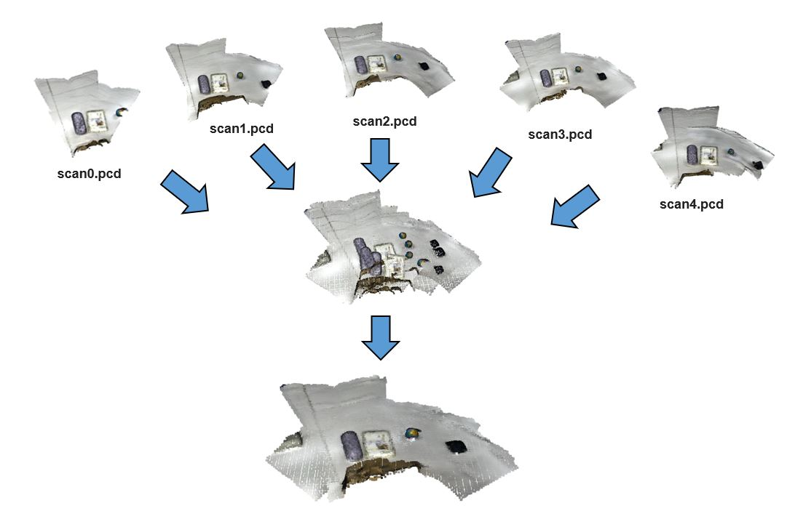
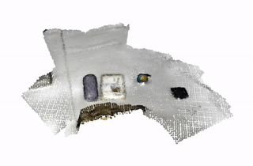

    
  </a>

  <h3 align="center">Merge Point Clouds</h3>
  

   Implementing Multiway Registration for merging several point clouds.
  

# Input data
Input point clouds were scanned using iPhone 12 Pro LiDAR Scanner.

# Visualization of merged point cloud

## References:
- [Multiway registration](http://www.open3d.org/docs/latest/tutorial/Advanced/multiway_registration.html)